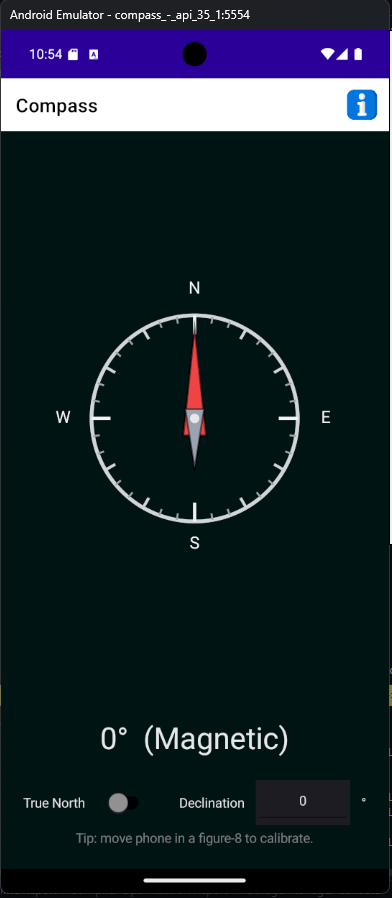

# MawiCompass 🧭

A tiny, privacy-friendly GPS-free compass built with .NET MAUI.
Works anywhere 

- **no internet, no accounts, no ads, no tracking**.

- Uses the phone’s magnetometer + tilt compensation to show Magnetic North

- Optional True North mode via manual declination (east = +, west = −)

- Haptic “snap” when you align to N/E/S/W

- Interference warning if magnetic readings look off

- Smooth, dark UI with a red north needle, minor ticks every 10°, and an info page

Why GPS-free? It still points north even if GPS is jammed, spoofed, or offline.

--- 

## Features

- 🧭 Magnetic heading (tilt-compensated) — no GPS required

- 🎯 True North toggle with declination input & persistent settings

- 💥 Haptic feedback near 0°/90°/180°/270°

- ⚠️ Interference detection (typical Earth field 25–65 µT)

- 🌙 Dark theme, clear dial, minor ticks every 10°

- ℹ️ Declination info page with links to trusted resources

- 🛡️ No network calls, ads, analytics, or permissions (Android)

---  

## Screenshot

---

## Tech Stack

- .NET 8 + .NET MAUI

- MAUI Essentials: Compass, Magnetometer, HapticFeedback

- Simple sensor fusion & smoothing via a Low-pass filter

---

## Getting Started

**Prerequisites:**

- Visual Studio 2022 with the .NET MAUI workload

- Android SDK / Emulator (for development)

- A real device for testing (emulators usually have no magnetometer)

- Or download the ready to Android APK : 

---

## Run (Debug)

1. Open the solution in VS.

2. Select Android and your physical device in the target dropdown.

3. Press ▶ Run.

On emulators, the heading will stay at 0° because there’s no magnetometer.

---

## Build Release APK (sideload)

1. Set Configuration to Release.

2. Build → Archive → Distribute → Ad Hoc → APK.

3. Sign with your keystore and install on device:
	- 'adb install -r path\to\MawiCompass-Signed.apk'

---

## True North / Declination

- Toggle True North on/off in the UI.

- Enter declination in degrees:

	- East = positive (e.g., +2.5)

	- West = negative (e.g., -4)

- Values are saved using Preferences.

- Declination changes slowly. Set it once for your region or open the Info page to find it.

--- 

